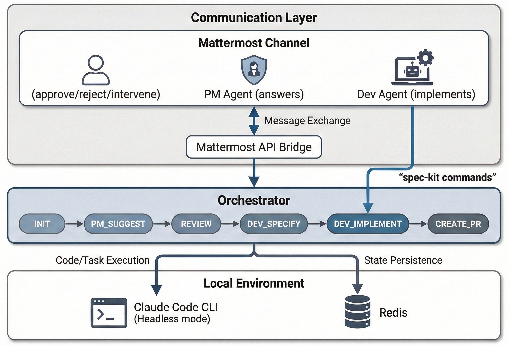

# Architecture

System components, technical decisions, and dependencies.



## High-Level Architecture

### Standalone Mode (Single Process)
```
+-------------------+     Mattermost API     +-------------------+
|   Mattermost      | <---------------------> |   Orchestrator    |
|   Channel         |                        |   (Python)         |
|   - Human         |                        +----------+----------+
|   - PM Bot        |                                 |
|   - Dev Bot       |                                 v
+-------------------+                         +----------+----------+
                                                  |
                                                  v
                                         +--------+--------+
                                         | Claude Code      |
                                         | CLI (claude)    |
                                         +--------+--------+
                                                  |
                                                  v
                                         +--------+--------+
                                         | Target Repo     |
                                         | (git worktree)  |
                                         +-----------------+
```

### Worker Pool Mode (Distributed)
```
+-------------------+     Mattermost API     +-------------------+
|   Mattermost      | <---------------------> |   Orchestrator    |
|   Channel         |                        |   (Coordinator)   |
|   - Human         |                        +----------+--------+
|   - PM Bot        |                                 |
|   - Dev Bot       |                                 | Redis Stream
+-------------------+                                 | (feature-requests)
                                                      |
                                                      v
                                         +------------+-----------+
                                         |                        |
                                         v                        v
                                  +------+-------+         +------+-------+
                                  | Worker-1   |         | Worker-N   |
                                  | (Consumer) |         | (Consumer) |
                                  +------+-------+         +------+-------+
                                         |                        |
                                         v                        v
                                  +------+-------+         +------+-------+
                                  | Claude Code|         | Claude Code |
                                  | CLI        |         | CLI         |
                                  +------+-------+         +------+-------+
```

## Components

### 1. Orchestrator (`orchestrator.py`)

Central script managing workflow state machine. Can run in two modes:

**Standalone Mode:** Runs all phases sequentially (PM_SUGGEST → REVIEW → DEV_SPECIFY → DEV_PLAN → DEV_TASKS → PLAN_REVIEW → DEV_IMPLEMENT → CREATE_PR → PM_LEARN)

**Coordinator Mode (--loop):** After REVIEW approval, publishes feature to Redis stream and skips to next PM_SUGGEST. Enables workers to handle implementation in parallel.

**State machine phases (standalone):**
| Phase | Description | Agent | Checkpoint? |
|-------|-------------|-------|--------------|
| INIT | Load config, verify connectivity | -- | No |
| PM_SUGGEST | PM reads PRD, suggests feature | PM | No |
| REVIEW | Human approves/rejects | -- | **Yes** |
| DEV_SPECIFY | Dev runs `/speckit.specify` | Dev | No |
| DEV_PLAN | Dev runs `/speckit.plan` | Dev | No |
| DEV_TASKS | Dev runs `/speckit.tasks` | Dev | No |
| PLAN_REVIEW | Human reviews plan | PM | **Yes** |
| DEV_IMPLEMENT | Dev runs `/speckit.implement` | Dev+PM | On questions |
| CREATE_PR | Dev creates PR | Dev | No |
| PM_LEARN | PM writes learnings | PM | No |
| DONE | Post PR URL | -- | No |

**State machine phases (coordinator mode):**
| Phase | Description | Agent | Checkpoint? |
|-------|-------------|-------|--------------|
| INIT | Load config, verify connectivity | -- | No |
| PM_SUGGEST | PM reads PRD, suggests feature | PM | No |
| REVIEW | Human approves/rejects | -- | **Yes** |
| *(publish to stream)* | Feature published to Redis | -- | -- |
| *(skip to PM_SUGGEST)* | Loop for next feature | -- | -- |

### 2. Mattermost Bridge (`mattermost_bridge.py`)

Handles Mattermost communication:
- `send(message, sender)` - Post to channel
- `read_posts(limit, after)` - Fetch posts
- `read_new_human_messages()` - Filter human messages
- `wait_for_response(timeout)` - Poll for response

Two bot identities:
- **Dev bot**: For dev agent and orchestrator messages
- **PM bot**: For PM agent messages

### 3. Responder (`responder.py`)

Daemon that listens for commands:
- `/suggest` - Start workflow
- `/suggest "Feature"` - Implement specific feature
- `@product-manager <question>` - Ask PM questions
- `@dev-agent <question>` - Ask Dev questions (during implementation)

### 4. Worker (`worker.py`)

Redis Streams consumer that picks up approved features from the stream and runs implementation:

1. Listens on `feature-requests` stream
2. Picks up message when available
3. Runs orchestrator in feature mode: `orchestrator.py --feature "..."`
4. Executes: DEV_SPECIFY → DEV_PLAN → DEV_TASKS → PLAN_REVIEW → DEV_IMPLEMENT → CREATE_PR

Multiple workers can run in parallel for throughput.

### 5. Agent Definitions

- `.claude/agents/pm-agent.md` - PM role
- `.claude/agents/dev-agent.md` - Dev role

## Technical Decisions

### Why `claude -p` (headless CLI)?
- Simpler setup (no npm/pip packages)
- Session management built in (`--resume`)
- Output formats (json, stream-json) handle structured communication

### Why Mattermost API directly?
- No extra dependencies
- Full control over API features
- Two bot identities for clear attribution

### Why Orchestrator + Workers?
- **Orchestrator** is lightweight (just coordinates)
- **Workers** do heavy lifting (run Claude Code)
- Multiple features can run in parallel
- Each worker has independent state

### Why Spec Kit?
- Structured output (spec.md, plan.md, tasks.md)
- Phases map cleanly to orchestrator states
- Task checklist format enables progress reporting

## Dependencies

- **uv**: Dependency management
- **Redis**: Stream distribution and state persistence
- **Claude Code CLI**: AI agent execution
- **GitHub CLI**: PR creation
- **Python 3.10+**: Runtime
- **Mattermost**: Communication channel
