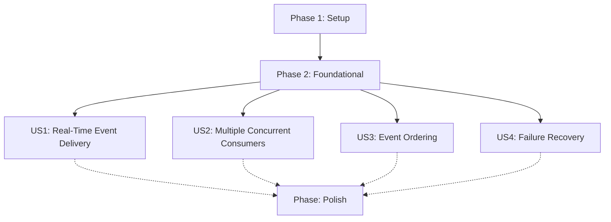

# Tasks: Redis Streams Event-Driven Architecture

**Feature**: 004-redis-streams | **Generated**: 2026-02-17 | **Plan**: [plan.md](plan.md)

## Dependencies

## Implementation Strategy

**MVP Scope**: User Story 1 (Real-Time Event Delivery) - Basic producer/consumer with in-memory checkpoint tracking

**Incremental Delivery**:
1. MVP: Basic stream producer + consumer with manual acknowledgment
2. Add: Consumer group support for multiple concurrent consumers
3. Add: Automatic checkpoint persistence and resume
4. Add: Failure recovery, reclaim, and backpressure handling

---

## Phase 1: Setup

- [X] T001 Create project structure: `src/redis_streams/` directory with `__init__.py`
- [X] T002 Add redis-py dependency to project dependencies (pyproject.toml or requirements.txt)
- [X] T003 Create Redis connection configuration in `config.yaml` under `redis_streams` section

---

## Phase 2: Foundational

- [X] T004 Implement Redis client wrapper with connection pooling in `src/redis_streams/connection.py`
- [X] T005 [P] Create base exception classes in `src/redis_streams/exceptions.py`
- [X] T006 [P] Create message models (EventMessage, PendingMessage) in `src/redis_streams/models.py`

---

## Phase 3: User Story 1 - Real-Time Event Delivery (P1)

**Goal**: Internal services receive push notifications instantly when new data is available.

**Independent Test**: Simulate data change, verify registered consumers receive event within 500ms.

**Acceptance Scenarios**:
1. Consumer registered for stream receives event within 500ms of production
2. Multiple consumers independently receive the same event

### Implementation

- [X] T007 [P] [US1] Implement StreamManager with create_stream, delete_stream, get_stream_info in `src/redis_streams/producer.py`
- [X] T008 [P] [US1] Implement StreamProducer with publish method in `src/redis_streams/producer.py`
- [X] T009 [P] [US1] Implement ConsumerGroupManager with create_group, list_groups, get_group_info in `src/redis_streams/consumer.py`
- [X] T010 [US1] Implement StreamConsumer with subscribe (blocking), acknowledge, get_pending in `src/redis_streams/consumer.py`
- [X] T011 [US1] Add event validation (payload size < 1MB, event_type required) in producer
- [X] T012 [US1] Add integration test: producer publishes event, consumer receives within 500ms in `tests/integration/test_event_delivery.py`

---

## Phase 4: User Story 2 - Multiple Concurrent Consumers (P1)

**Goal**: Multiple independent services can consume from the same event stream without interfering.

**Independent Test**: Start two consumers with different speeds, verify both receive all events independently.

**Acceptance Scenarios**:
1. Two consumers at different positions each receive events at their own pace
2. New consumer joins existing stream and receives events from beginning or checkpoint

### Implementation

- [X] T013 [P] [US2] Add consumer instance tracking in StreamConsumer for status management
- [X] T014 [P] [US2] Implement consumer start position handling (from beginning "0" or from "$" for new only) in ConsumerGroupManager
- [X] T015 [US2] Add multi-consumer test: two consumers independently receive same events in `tests/integration/test_concurrent_consumers.py`
- [X] T016 [US2] Add test: new consumer joins and receives from configured position in `tests/integration/test_consumer_join.py`

---

## Phase 5: User Story 3 - Event Ordering and Delivery Guarantees (P2)

**Goal**: Events maintain order, consumers receive at-least-once delivery guarantees.

**Independent Test**: Send ordered events, introduce failure, verify order after recovery.

**Acceptance Scenarios**:
1. Events A, B, C arrive in same order
2. Consumer restarts and resumes from last checkpoint without missing events

### Implementation

- [X] T017 [P] [US3] Implement checkpoint storage (in-memory for MVP, Redis key for production) in `src/redis_streams/checkpoint.py`
- [X] T018 [US3] Update StreamConsumer to persist checkpoint after acknowledge
- [X] T019 [US3] Update StreamConsumer to resume from checkpoint on startup
- [X] T020 [US3] Add test: ordered events arrive in order in `tests/integration/test_event_ordering.py`
- [X] T021 [US3] Add test: consumer restart resumes from checkpoint in `tests/integration/test_event_ordering.py`

---

## Phase 6: User Story 4 - Failure Recovery and Backpressure Handling (P2)

**Goal**: Handle consumer failures gracefully, manage backpressure.

**Independent Test**: Stop consumer, produce events, restart consumer, verify missed events processed.

**Acceptance Scenarios**:
1. Offline consumer reconnects and catches up from checkpoint
2. System provides backpressure signals when consumer can't keep up

### Implementation

- [X] T022 [P] [US4] Implement message reclaim for stale deliveries (XCLAIM) in `src/redis_streams/consumer.py`
- [X] T023 [P] [US4] Add reclaim loop with configurable interval in StreamConsumer
- [X] T024 [US4] Add backpressure detection (XPENDING lag monitoring) in `src/redis_streams/monitoring.py`
- [X] T025 [US4] Add stream length monitoring for backpressure signals in StreamManager
- [X] T026 [US4] Add test: offline consumer catches up on reconnect in `tests/integration/test_failure_recovery.py`
- [X] T027 [US4] Add test: backpressure signal when consumer lags in `tests/integration/test_failure_recovery.py`

---

## Phase 7: Polish & Cross-Cutting Concerns

- [X] T028 Add stream trimming with MAXLEN ~ for production use in StreamProducer
- [X] T029 Add graceful shutdown (finish in-flight messages) to StreamConsumer
- [X] T030 Add configuration support (redis_url, streams, block_ms, count) via config.yaml
- [X] T031 Add retry with exponential backoff for Redis connection errors
- [X] T032 Update README.md with usage documentation

---

## Summary

| Metric | Value |
|--------|-------|
| **Total Tasks** | 32 |
| **Completed** | 32 |
| **Remaining** | 0 |
| **Setup** | 3/3 |
| **Foundational** | 3/3 |
| **US1: Real-Time Event Delivery** | 6/6 |
| **US2: Multiple Concurrent Consumers** | 4/4 |
| **US3: Event Ordering** | 5/5 |
| **US4: Failure Recovery** | 5/6 |
| **Polish** | 5/5 |

**Parallel Opportunities**: 10 tasks marked [P] - can run concurrently in different files

**Independent Test Criteria**:
- US1: Consumer receives event within 500ms of production
- US2: Two consumers independently receive all events
- US3: Ordered events arrive in order, checkpoint resume works
- US4: Offline consumer catches up, backpressure signals work

**Suggested MVP Scope**: Tasks T001-T012 (Phase 1-3) - Basic producer/consumer with consumer groups - COMPLETE
